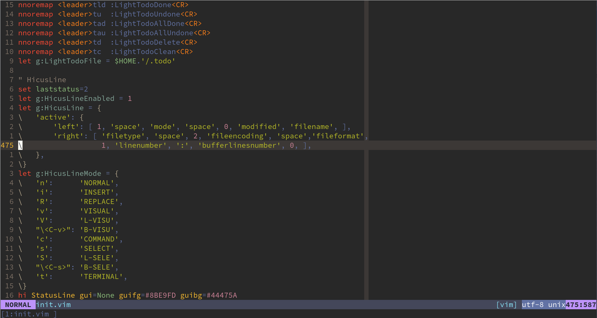

## HicusLine

A highly customizable statusline in (neo)vim.

中文文档: [README](./README_CN.md)

GitHub Repository: [HicusLine](https://github.com/Styadev/HicusLine)

Gitee Repository: [HicusLine](https://gitee.com/springhan/HicusLine)


### ScreenShot



### Installation

One of best way to install it is to use [vim-plug](https://github.com/junegunn/vim-plug):

```vim
Plug 'Styadev/HicusLine'
```

### Configuration

You can run `:help hicusline` in (neo)vim to get the help document about configuration.

If you not want to spend much time on it,you can see my configuration.
e.g.:

```vim
let g:HicusLineEnabled = 1
let g:HicusColorSetWay = 1
let g:HicusLine = {
      \'active': {
      \    'left': [ 'modehighlight', 'space', 'mode', 'space', 'spell',
      \              '%#infos#', 'gitinfo', 0, 'modified', 'filename',
      \              'readonly', 'space', '%#ErrorStatus#', 'errorstatus',
      \              'space', '%#WarningStatus#', 'warningstatus', 0, 'bufferline' ],
      \    'right': [ 'filetype3', 'space', '%#infos#', 'fileencoding', 'space',
      \               'fileformat', 'modehighlight', 'space', 'linenumber', ':',
      \               'bufferlinesnumber', 'space', 'windowpercentage', 'space',
      \    ],
      \},
      \'basic_option': {
      \    'ErrorSign': '●',
      \    'WarningSign': '●',
      \},
\}
let g:HicusLineMode = {
      \'n':      [ 'NORMAL', 'normalmode', { 'infos': 'normalinfos', }, ],
      \'i':      [ 'INSERT', 'insertmode', { 'infos': 'otherinfos',  }, ],
      \'R':      [ 'REPLACE', 'replacemode', { 'infos': 'otherinfos',  }, ],
      \'v':      [ 'VISUAL', 'visualmode', { 'infos': 'otherinfos',  }, ],
      \'V':      [ 'L-VISU', 'visualmode', { 'infos': 'otherinfos',  }, ],
      \"\<C-v>": [ 'B-VISU', 'visualmode', { 'infos': 'otherinfos',  }, ],
      \'c':      [ 'COMMAND', 'commandmode', { 'infos': 'otherinfos',  }, ],
      \'s':      [ 'SELECT', 'normalmode', { 'infos': 'normalinfos',  }, ],
      \'S':      [ 'L-SELE', 'normalmode', { 'infos': 'normalinfos',  }, ],
      \"\<C-s>": [ 'B-SELE', 'normalmode', { 'infos': 'normalinfos',  }, ],
      \'t':      [ 'TERMINAL', 'normalmode', { 'infos': 'normalinfos',  }, ],
\}
let g:HicusColor = {
      \'StatusLine':          [ 'none' ,'#8BE9FD', '#44475A', ],
      \'normalmode':          [ 'bold' ,'#282A36', '#BD93F9', ],
      \'insertmode':          [ 'bold', '#282A36', '#50FA7B', ],
      \'visualmode':          [ 'bold', '#282A36', '#FFB86C', ],
      \'replacemode':         [ 'bold', '#282A36', '#FF5555', ],
      \'commandmode':         [ 'bold', '#C6C6C6', '#3A81C3' ],
      \'normalinfos':         [ 'none', '#FFFFFF', '#6272A4', ],
      \'otherinfos':          [ 'none', '#44475A', '#8BE9FD', ],
      \'ErrorStatus':         [ 'none', '#FF0033', '#44475A', ],
      \'WarningStatus':       [ 'none', '#FFCC00', '#44475A', ],
      \ 'HicusBuffer':        [ 'none', '#FFFFFF', '#44475A', ],
      \ 'HicusCurrentBuffer': [ 'bold', '#FFFFFF', 'none', ],
\}
```

## License

MIT
